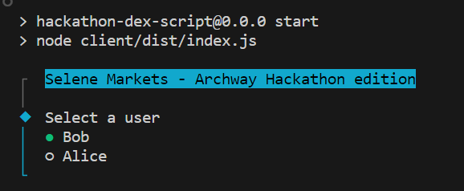
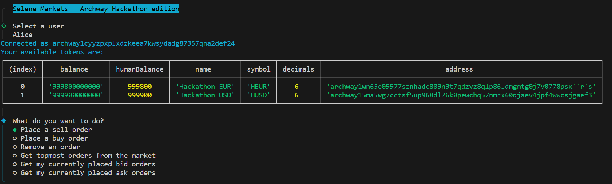
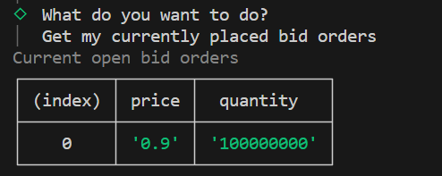

# Selene Markets 

## Overview
This repository contains the code for Selene, a decentralized exchange (DEX) smart contract implemented in Rust using the CosmWasm framework. The smart contract is designed for the Archways blockchain and facilitates the trading of various assets on the platform. The DEX is based on an order book model, allowing users to place limit and market orders.

This is a submission for a hackaton and should not be considered production-ready. 

### IMPORTANT: See the following "Using the CLI" section to start using the already deployed contract on testnet  


## Testnet Setup 
The deployed smart contract can be found at the following address on the Archways testnet (constantine-3):
```
archway19z2f7du39v9q5m427s0fu5344u3qwyyxeqaknhhu0ntwankqz8gqapezf0
```  

It has been preset with a market for trading with 2 CW20 tokens.  
The market is HEUR-HUSD, which stands for Hackaton EUR and Hackaton USD.  


## Using the CLI  

1- Clone this repository   
2- Install dependencies (npm install)  
3- Build (npm run build)  
4- Launch the CLI (npm run start)   

When running the CLI you will be asked to choose a user.  



Then you will be able to perform a variety of operations: 
- Get your current orders on the market  
- Get the top orders on the market 
- Send a limit order  
- Cancel an existing order 



Here's an example response from querying the user bids  




## Interacting with the contract


## Smart Contract Messages

### InstantiateMsg
This message is used for instantiating the smart contract. It does not require any parameters.

### AdminExecuteMsg
This enum defines messages related to administrative actions on the DEX. It includes the following variants:
- **UpdateAdmin**: Updates the administrator's address to a new address. It takes a `new_admin` parameter specifying the new administrator's address.
- **AddMarket**: Adds a new market to the DEX. It requires specifying the base currency and quote currency information using `base_currency` and `quote_currency` parameters, respectively.

### SeleneCw20Msg
This enum defines messages that can be used in a cw20::send message. It includes the following variants:
- **LimitOrder**: Places a limit order for a native coin. It requires specifying the `market_id` and `price` of the order.
- **MarketOrder**: Places a market order for a native coin. It requires specifying the `market_id` of the order.

### ExecuteMsg
This enum defines messages that can be executed on the DEX. It includes the following variants:
- **Receive**: Handles Cw20ReceiveMsg messages.
- **LimitOrder**: Places a limit order for a native coin. It requires specifying the `market_id` and `price` of the order.
- **MarketOrder**: Places a market order for a native coin. It requires specifying the `market_id` of the order.
- **RemoveLimitOrder**: Removes a limit order for a native coin. It requires specifying the `market_id` and `price` of the order.
- **Admin**: Executes administrative actions on the DEX using the AdminExecuteMsg enum.

### QueryMsg
This enum defines messages for querying information from the DEX. It includes the following variants:
- **GetAdmin**: Retrieves the administrator's address.
- **GetMarkets**: Retrieves information about all available markets.
- **GetUserBids**: Retrieves the user's bids (limit orders). It requires specifying the `user_address` and an optional `target_market`.
- **GetUserAsks**: Retrieves the user's asks (limit orders). It requires specifying the `user_address` and an optional `target_market`.
- **GetUserOrders**: Retrieves all orders placed by a user. It requires specifying the `user_address` and an optional `target_market`.
- **GetMarketBook**: Retrieves the order book for a specific market. It requires specifying the `market_id` and the number of order book levels to include (`nb_levels`).

### Query Response Structs
The following structs are used as response types for the corresponding query messages:

#### GetMarketBookResponse
- **bids**: An array of `BookLevel` structs representing the bid orders in the market's order book.
- **asks**: An array of `BookLevel` structs representing the ask orders in the market's order book.

#### GetMarketsResponse
- **markets**: An array of `SingleMarketInfo` structs representing information about available markets.

#### GetUserOrdersResponse
- **orders**: An array of `UserOrderRecord` structs representing the orders placed by the user.

#### GetUserBidsResponse
- **orders**: An array of `UserOrderRecord` structs representing the user's bid orders (limit orders).

#### GetUserAsksResponse
- **orders**: An array of `UserOrderRecord` structs representing the user's ask orders (limit orders).

#### GetAdminResponse
- **admin**: An optional `Addr` struct representing the administrator's address. If no administrator has been set, it will be `None`.

## Getting Started
To deploy and use your own instance of Selene, follow these steps:

1. Install Rust and set up the development environment.
2. Clone this repository to your local machine.
3. Import the required dependencies for the smart contract.
4. Build the smart contract using the Rust compiler and cosmwasm optimizer
5. Deploy the compiled smart contract to the Archways blockchain.

## Examples
Here are some examples of how to interact with the Archways DEX smart contract:

1. Placing a limit order:
```rust
let msg = SeleneCw20Msg::LimitOrder {
    market_id: 1,
    price: Decimal::from_ratio(100, 1),
};
```

2. Adding a new market (only admin):
```rust
let base_currency = CurrencyInfo::Native {
    denom: "ATOM".to_string(),
};
let quote_currency = CurrencyInfo::Cw20 {
    address: "contract_address".to_string(),
};

let msg = AdminExecuteMsg::AddMarket {
    base_currency,
    quote_currency,
};
```

3. Querying user's bids:
```rust
let msg = QueryMsg::GetUserBids {
    user_address: user_address.into(),
    target_market: Some(1), // Optional: specify a target market, or leave as None to get bids on all markets
};
```

These examples demonstrate only a few interactions with the Selene contract.


